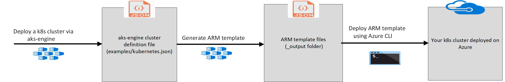
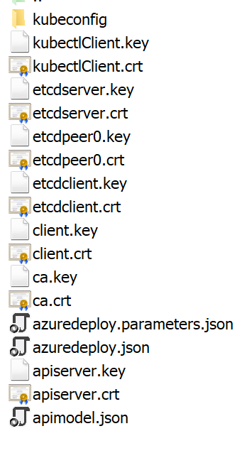

# AKS Engine — How to deploy a K8s On Azure

The most flexible way to deploy unmanaged Kubernetes into Azure is to use (`aks-engine`). The  Azure Kubernetes Engine (`aks-engine`) generates ARM (Azure Resource Manager) templates for Kubernetes clusters on Azure. The input to aks-engine is a cluster definition file which describes the desired cluster, including orchestrator, features, and agents. The structure of the input files is very similar to the public API for Azure Kubernetes Service.

## Prerequisites

The following prerequisites are required for a successful use of AKS Engine.

1. An Azure Subscription
1. The [Azure CLI](https://docs.microsoft.com/en-us/cli/azure/install-azure-cli)


## Install AKS Engine

You can choose to install aks-engine using *gofish*. You can install gofish following the [instructions](https://gofi.sh/#install) for your OS.

```console
$ gofish install aks-engine

Installing aks-engine...
aks-engine 0.29.1: installed in 1.061691345s

```

## Completion

AKS Engine supports bash completion. To enable this, add the following to your `.bashrc` or `~/.profile`

```bash
source <(aks-engine completion)
```

## Deploy your First Cluster



`aks-engine` reads a cluster definition file which describes the size, shape, and configuration of your cluster. `aks-engine` takes this file of one master and two Linux agents, reads it, and builds an ARM template file, which is a declarative syntax that the provisioning engines in Azure use to deploy infrastructure. If you would like to change the configuration, edit `examples/kubernetes.json` before continuing *You have to create an examples folder then a kubernetes.json file*. Here is an example of *kubernetes.json*:

`
{
  "apiVersion": "vlabs",
  "properties": {
    "orchestratorProfile": {
      "orchestratorType": "Kubernetes"
    },
    "masterProfile": {
      "count": 1,
      "dnsPrefix": "",
      "vmSize": "Standard_D2_v2"
    },
    "agentPoolProfiles": [
      {
        "name": "agentpool1",
        "count": 2,
        "vmSize": "Standard_D2_v2"
      }
    ],
    "linuxProfile": {
      "adminUsername": "azureuser",
      "ssh": {
        "publicKeys": [
          {
            "keyData": "<your-ssh-rsa>  root@<your-vm-name>"
          }
        ]
      }
    },
    "servicePrincipalProfile": {
      "clientId": "<service-principal-appId>",
      "secret": "<service-principal-epassword>"
    }
  }
}
`

**NOTE:** The Azure Resource Manager enables you to work with the resources in your solution as a group. You can deploy, update, or delete all the resources for your solution in a single, coordinated operation. You use a template for deployment and that template can work for different environments such as testing, staging, and production. Resource Manager provides security, auditing, and tagging features to help you manage your resources after deployment. The Azure command line tooling can take these ARM template files and build out a Kubernetes cluster based on the elements in the original cluster definition file.

The `aks-engine deploy` command automates creation of a Service Principal, Resource Group and SSH key for your cluster. If operators need more control or are interested in the individual steps see the ["Long Way" section below](#aks-engine-the-long-way).

**NOTE:** AKS Engine creates a _cluster_; it _doesn't_ create an Azure Kubernetes Service (AKS) resource. Clusters that you create using the `aks-engine` command (or ARM templates generated by the `aks-engine` command) won't show up as AKS resources, for example when you run `az aks list`.

After the cluster is deployed, the upgrade and scale commands can be used to make updates to your cluster.

You can find all files created after `aks-engine deploy` in *_output folder*



### Gather Information required to run *aks-engine deploy* command

* The subscription in which you would like to provision the cluster. This is a uuid which can be found with `az account list -o table`.
* Proper access rights within the subscription; especially the right to create and assign [service principals][sp] to applications
* A `dnsPrefix` which forms part of the the hostname for your cluster (e.g. staging, prodwest, blueberry). The DNS prefix must be unique so pick a random name.
* A location to provision the cluster e.g. `westus2`.

```sh
$ az account list -o table
Name                                             CloudName    SubscriptionId                        State    IsDefault
-----------------------------------------------  -----------  ------------------------------------  -------  -----------
<your-Subscription>                             AzureCloud   51ac25de-afdg-9201-d923-8d8e8e8e8e8e  Enabled  True
```

### Deploy

For this example, the subscription id is `51ac25de-afdg-9201-d923-8d8e8e8e8e8e`, the DNS prefix is `argo-trial`, and the location is `centralus`.

First, we need to log in to Azure:

```console
$ az login
Note, we have launched a browser for you to login. For old experience with device code, use "az login --use-device-code"
You have logged in. Now let us find all the subscriptions to which you have access...
```

Next, we'll create a resource group. A resource group is a container that holds related resources for an Azure solution. In Azure, you logically group related resources such as storage accounts, virtual networks, and virtual machines (VMs) to deploy, manage, and maintain them as a single entity. In this case, we want to deploy, manage and maintain the whole Kubernetes cluster as a single entity.

```console
$ az group create --name Argo-rg --location centralus
{
  "id": "/subscriptions/51ac25de-afdg-9201-d923-8d8e8e8e8e8e/resourceGroups/Argo-rg",
  "location": "centralus",
  "managedBy": null,
  "name": "Argo-rg",
  "properties": {
    "provisioningState": "Succeeded"
  },
  "tags": null
}
```

Once that's done, we need to create a [service principal][sp] for the Kubernetes cluster so it can talk to any resources that are a part of the same resource group.

```console
$ az ad sp create-for-rbac --role="Contributor" --scopes="/subscriptions/51ac25de-afdg-9201-d923-8d8e8e8e8e8e/resourceGroups/Argo-rg"
{
  "appId": "a6bf192e-5775-4378-b7dc-8c5ab961ef2e",
  "displayName": "azure-cli-2019-02-13-21-23-19",
  "name": "http://azure-cli-2019-02-13-21-23-19",
  "password": "106dd177-b34e-47bf-b135-9f97ecf84d8b",
  "tenant": "72f988bf-86f1-41af-91ab-2d7cd011db47"
}
```

Make a note of the `appId` and the `password` fields, as we will be providing them as parameters in the next step.

Finally, run `aks-engine deploy` with the appropriate arguments:

```console
$ aks-engine deploy --subscription-id 2ab98f94-0381-426e-a018-81df2aec6007 --auth-method cli --dns-prefix argo-trial --resource-group Argo-rg --location centralus --api-model examples/kubernetes.json -- set servicePrincipalProfile.clientId="8c056bc0-a9a1-4cb6-af30-a408a63386e7" --set servicePrincipalProfile.secret="e538c508-ba34-436d-8d6d-8382a276a4c7"


INFO[0020] Starting ARM Deployment (Argo-rg-450430410). This will take some time...
INFO[0238] Finished ARM Deployment (Argo-rg-450430410). Succeeded

```

It took about 4 minuest to deploy our cluster on Azure.

`aks-engine` will output Azure Resource Manager (ARM) templates, and a kubeconfig file in `_output/argo-trial` directory:

```console
~/_output/argo-trial$ ls
apimodel.json  azuredeploy.json             ca.key      etcdclient.crt  etcdpeer0.key   kubeconfig
apiserver.crt  azuredeploy.parameters.json  client.crt  etcdclient.key  etcdserver.crt  kubectlClient.crt
apiserver.key  ca.crt                       client.key  etcdpeer0.crt   etcdserver.key  kubectlClient.key

```

aks-engine generates kubeconfig files for each possible region. Access the new cluster by using the kubeconfig generated for the cluster's location. This example used `centralus`, so the kubeconfig is `_output/<clustername>/kubeconfig/kubeconfig.centralus.json`:

```sh
$ KUBECONFIG=_output/argo-trial/kubeconfig/kubeconfig.centralus.json kubectl cluster-info

Kubernetes master is running at https://argo-trial.centralus.cloudapp.azure.com
Heapster is running at https://argo-trial.centralus.cloudapp.azure.com/api/v1/namespaces/kube-system/services/heapster/proxy
KubeDNS is running at https://argo-trial.centralus.cloudapp.azure.com/api/v1/namespaces/kube-system/services/kube-dns:dns/proxy
kubernetes-dashboard is running at https://argo-trial.centralus.cloudapp.azure.com/api/v1/namespaces/kube-system/services/https:kubernetes-dashboard:/proxy
Metrics-server is running at https://argo-trial.centralus.cloudapp.azure.com/api/v1/namespaces/kube-system/services/https:metrics-server:/proxy
tiller-deploy is running at https://argo-trial.centralus.cloudapp.azure.com/api/v1/namespaces/kube-system/services/tiller-deploy:tiller/proxy

To further debug and diagnose cluster problems, use 'kubectl cluster-info dump'.

```

Administrative note: By default, the directory where aks-engine stores cluster configuration (`_output/argo-trial` above) won't be overwritten as a result of subsequent attempts to deploy a cluster using the same `--dns-prefix`) To re-use the same resource group name repeatedly, include the `--force-overwrite` command line option with your `aks-engine deploy` command. On a related note, include an `--auto-suffix` option to append a randomly generated suffix to the dns-prefix to form the resource group name, for example if your workflow requires a common prefix across multiple cluster deployments. Using the `--auto-suffix` pattern appends a compressed timestamp to ensure a unique cluster name (and thus ensure that each deployment's configuration artifacts will be stored locally under a discrete `_output/<resource-group-name>/` directory).


<a href="#the-long-way"></a>

## AKS Engine the Long Way

This example uses the more traditional method of generating raw ARM templates, which are submitted to Azure using the `az group deployment create` command.

For this example, we will use the same information as before: the subscription id is `51ac25de-afdg-9201-d923-8d8e8e8e8e8e`, the DNS prefix is `argo-trial`, and the location is `centralus`.

Before we do anything, we need to log in to Azure:

```console
$ az login
Note, we have launched a browser for you to login. For old experience with device code, use "az login --use-device-code"
You have logged in. Now let us find all the subscriptions to which you have access...
```

We will also need to generate an SSH key. When creating VMs, you will need an SSH RSA key for SSH access. Use the following articles to create your SSH RSA Key:

1. Windows - https://www.digitalocean.com/community/tutorials/how-to-create-ssh-keys-with-putty-to-connect-to-a-vps
1. Mac and Linux - https://help.github.com/articles/generating-a-new-ssh-key-and-adding-it-to-the-ssh-agent/

Next, we'll create a resource group. A resource group is a container that holds related resources for an Azure solution. In Azure, you logically group related resources such as storage accounts, virtual networks, and virtual machines (VMs) to deploy, manage, and maintain them as a single entity. In this case, we want to deploy, manage and maintain the whole Kubernetes cluster as a single entity.

```console
$ az group create --name Argo-rg --location centralus
{
  "id": "/subscriptions/51ac25de-afdg-9201-d923-8d8e8e8e8e8e/resourceGroups/Argo-rg",
  "location": "centralus",
  "managedBy": null,
  "name": "Argo-rg",
  "properties": {
    "provisioningState": "Succeeded"
  },
  "tags": null
}
```

Once that's done, we need to create a [service principal][sp] for the Kubernetes cluster so it can talk to the any resources that are a part of the same resource group.

```console
$ az ad sp create-for-rbac --role="Contributor" --scopes="/subscriptions/51ac25de-afdg-9201-d923-8d8e8e8e8e8e/resourceGroups/Argo-rg"
{
  "appId": "a6bf192e-5775-4378-b7dc-8c5ab961ef2e",
  "displayName": "azure-cli-2019-02-13-21-23-19",
  "name": "http://azure-cli-2019-02-13-21-23-19",
  "password": "106dd177-b34e-47bf-b135-9f97ecf84d8b",
  "tenant": "72f988bf-86f1-41af-91ab-2d7cd011db47"
}
```

Make a note of the `appId` and the `password` fields, as we will be providing them in the next step.

AKS Engine consumes a cluster definition which outlines the desired shape, size, and configuration of Kubernetes. There are a number of features that can be enabled through the cluster definition: check the `examples` directory for a number of... examples.

Edit the [simple Kubernetes cluster definition](/examples/kubernetes.json) and fill out the required values:

* `dnsPrefix`: must be a region-unique name and will form part of the hostname (e.g. myprod1, staging, leapingllama) - be unique!
* `keyData`: must contain the public portion of the SSH key we generated - this will be associated with the `adminUsername` value found in the same section of the cluster definition (e.g. 'ssh-rsa AAAAB3NzaC1yc2EAAAADAQABA....')
* `clientId`: this is the service principal's appId uuid or name from earlier
* `secret`: this is the service principal's password or randomly-generated password from earlier

### Generate the Templates

The generate command takes a cluster definition and outputs a number of templates which describe your Kubernetes cluster. By default, `generate` will create a new directory named after your cluster nested in the `_output` directory. If your dnsPrefix was `argo-trial`, your cluster templates would be found in `_output/argo-trial`.

Run `aks-engine generate examples/kubernetes.json`

The `generate` command lets you override values from the cluster definition file without having to update the file. You can use the `--set` flag to do that:

```sh
aks-engine generate --set linuxProfile.adminUsername=myNewUsername,masterProfile.count=3 clusterdefinition.json
```

The `--set` flag only supports JSON properties under `properties`. You can also work with arrays, like the following:

```sh
aks-engine generate --set agentPoolProfiles[0].count=5,agentPoolProfiles[1].name=myPoolName clusterdefinition.json
```

Now we can deploy the files `azuredeploy.json` and `azuredeploy.parameters.json` using either the Azure CLI or PowerShell.

Using the CLI:

```console
$ az group deployment create \
    --name "argo-trial-k8s" \
    --resource-group "Argo-rg" \
    --template-file "./_output/argo-trial/azuredeploy.json" \
    --parameters "./_output/argo-trial/azuredeploy.parameters.json"
```